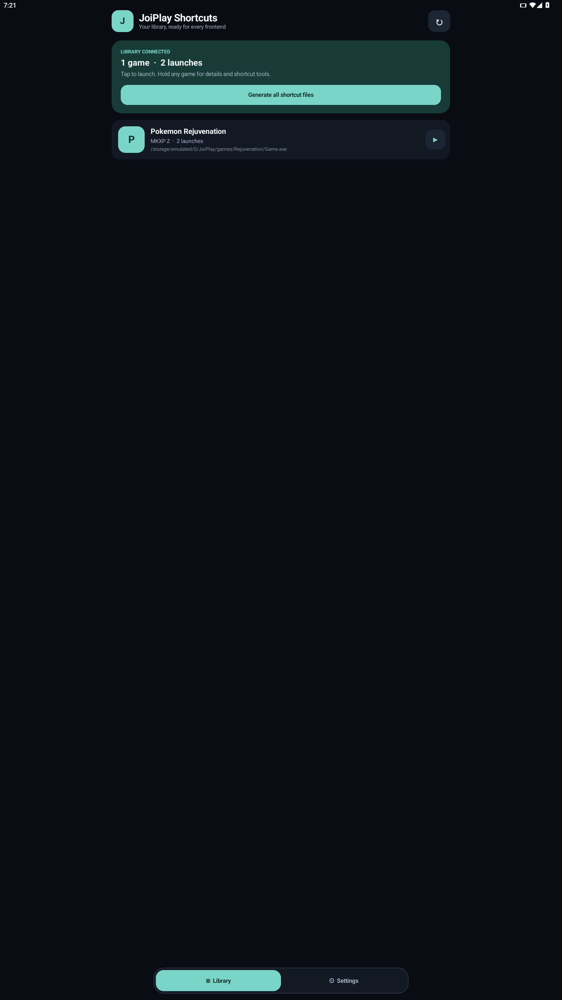

# JoiPlay Shortcut Generator

An original Android companion for turning the games already installed in
JoiPlay into launchable frontend files and Android home-screen shortcuts.

The app is deliberately focused: **Library** shows the live JoiPlay library,
and **Settings** controls how shortcuts are created. There is no store search,
account, ad, analytics SDK, or network permission.

## Highlights

- Reads the live JoiPlay game list through the project's read-only provider.
- Launches a selected game directly in JoiPlay.
- Long-press details with game ID, runtime, path, date, and play count.
- Generates one shortcut or the complete library in a single pass.
- Supports generic `.dpt` and dedicated `.joiplay` Daijishō templates.
- Pins individual games to the Android home screen.
- Remembers an output folder through Android's Storage Access Framework.
- System, light, and dark appearance modes.
- Title, recently-added, and most-played sorting.
- Responsive phone, tablet, portrait, and landscape layouts.
- No broad storage permission and no root requirement.



## Requirements

1. Android 8.0 (API 26) or newer.
2. A compatible modified JoiPlay build that exposes:
   `content://cyou.joiplay.joiplay.library/games`
3. The consumer permission:
   `cyou.joiplay.joiplay.permission.READ_LIBRARY`

An ordinary JoiPlay APK keeps its library in private app storage. Android does
not let a separate companion app read that file, so the read-only provider is
required. The app reports a clear connection error when the installed build
does not provide it.

## Use

1. Install a compatible modified JoiPlay build and add games in JoiPlay.
2. Install JoiPlay Shortcut Generator.
3. Open **Library**. Tap a game to launch it, or hold it for details.
4. Choose **Generate file**, or use **Generate all shortcut files**.
5. Select an output folder in Settings for one-tap and bulk exports.

Generated files contain:

```text
# Daijishou Player Template
[joiplay_id] YOUR_GAME_ID
...
```

See [Daijishō setup](docs/DAIJISHO_SETUP.md) for the included importable
platform definition and manual player arguments.

## Build

Prerequisites:

- JDK 21
- Android SDK Platform 36 and Build Tools 36

On Windows:

```powershell
$env:JAVA_HOME = "C:\Program Files\Android\Android Studio\jbr"
$env:ANDROID_HOME = "$env:LOCALAPPDATA\Android\Sdk"
.\gradlew.bat testDebugUnitTest lintDebug assembleDebug
```

The debug APK is written to
`app/build/outputs/apk/debug/app-debug.apk`.

Release builds are unsigned unless you configure Android signing locally or in
your release workflow. Never commit a keystore or its passwords.

## Project status

`0.1.0` is the first public-development build. The provider and direct-launch
contract were runtime-tested with JoiPlay `1.22.000-patreon` on Android 15.

## Privacy

The app has no Internet permission. Library data remains on-device and is read
only when the library refreshes. Shortcut files are written only to a document
or folder selected by the user. See [PRIVACY.md](PRIVACY.md).

## Relationship to other projects

This project is not affiliated with JoiPlay, Daijishō, or Valve. The focused
shortcut-generator interaction was inspired by
[NaviVani-dev/Steam-Shortcut-Generator](https://github.com/NaviVani-dev/Steam-Shortcut-Generator),
but this repository uses an original native Android implementation, visual
system, provider integration, assets, and product identity.

Before publishing third-party or modified JoiPlay APKs, verify that you have
the necessary redistribution rights. The companion app source is licensed
separately under the [MIT License](LICENSE).

